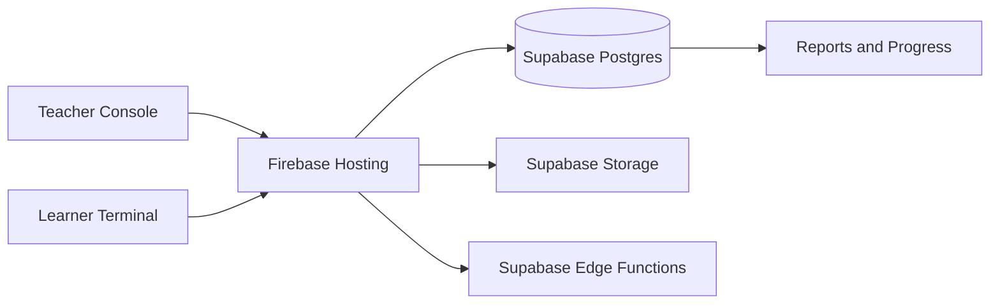
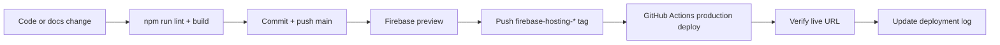

# Architecture

> Canonical implementation lives in the repository source code and Spec Kit artifacts.

## High-level stack

- Frontend: React 19 + TypeScript + Vite
- Hosting: Firebase Hosting (`chunks-offline`)
- Database: Supabase Postgres project `ftfxekdxeoxizoyxuqoz`
- Storage/Functions: Supabase Storage + Edge Functions for TTS/audio generation
- CI/CD: GitHub Actions

## High-level flow

## Main runtime areas

- `src/App.tsx`: app shell, routing, live data loading
- `src/components/SimulatorTab.tsx`: Teacher Console/live rooms
- `src/components/LearnerTerminalTab.tsx`: learner join/response UI
- `src/components/SettingsTab.tsx`: learner roster/settings plus CCI category, CCI card, and CVR standards management
- `src/components/HistoryTab.tsx`: reports/history with Session and Learner filters
- `src/components/LibraryTab.tsx`: courses/materials/sentence resources only
- `src/components/AudioGeneratorTab.tsx`: audio/TTS jobs

## Deployment flow

