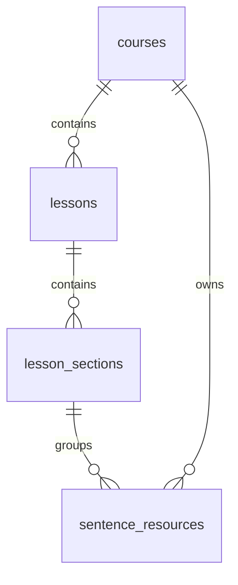

# Supabase Data Model

> Canonical schema source: Supabase project `ftfxekdxeoxizoyxuqoz`, generated types, and Spec Kit data model artifacts.

## Core product tables

- `courses`
- `lessons`
- `lesson_sections`
- `sentence_resources`
- `cci_categories`
- `cci_standard_cards`
- `cvr_units`
- `learners`
- `practice_rooms`
- `room_memberships`
- `room_rounds`
- `learner_responses`
- `learner_progress`

## Course hierarchy



## Live classroom hierarchy

```mermaid
erDiagram
    practice_rooms ||--o{ room_memberships : has
    practice_rooms ||--o{ room_rounds : has
    room_rounds ||--o{ learner_responses : captures
    learners ||--o{ room_memberships : joins
    learners ||--o{ learner_responses : submits
    learners ||--o{ learner_progress : accumulates
